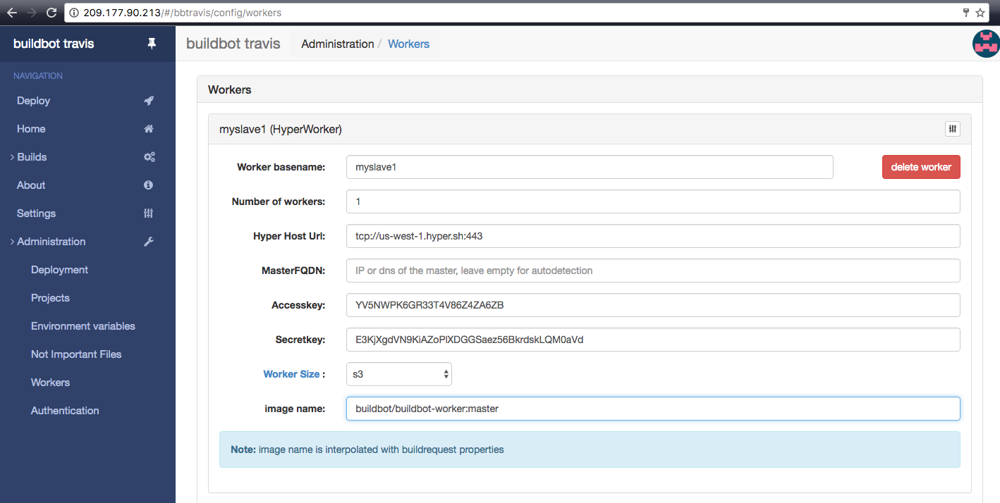
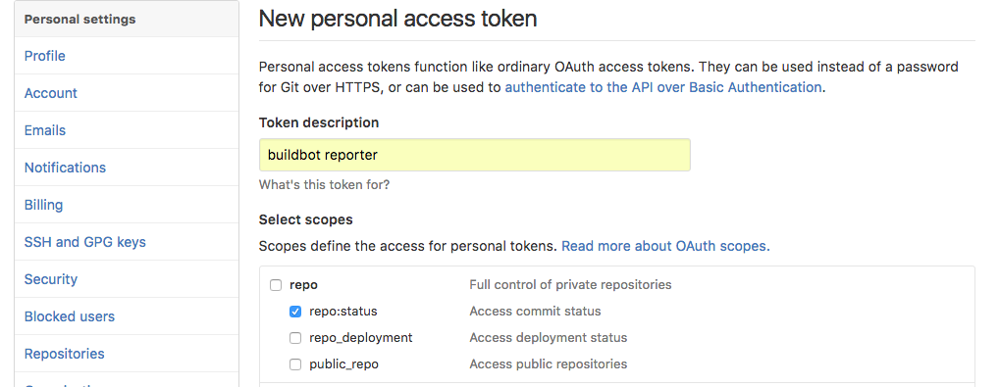
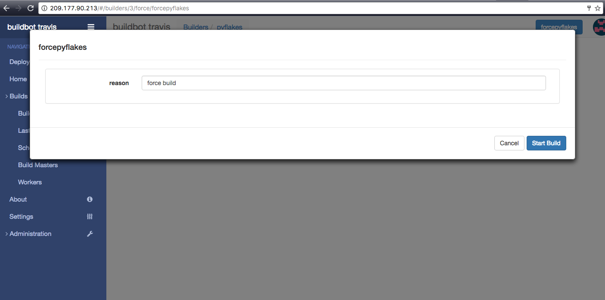
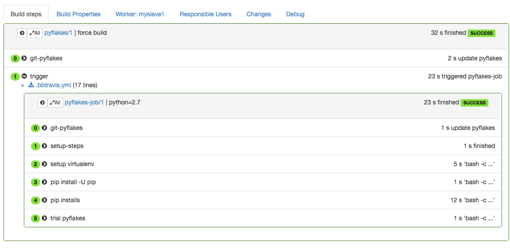
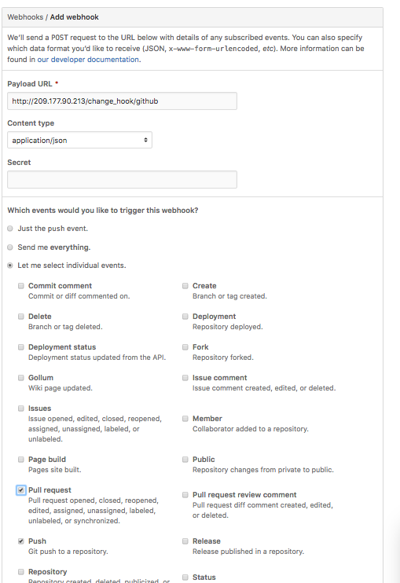
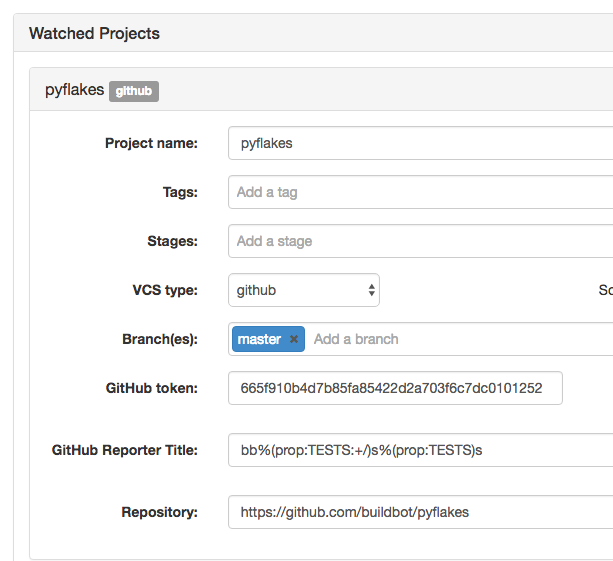

title: "How To Use Hyper.sh to deploy your Buildbot"
date: 2016-10-19 21:00:00 +0800
author: hyper
tags:
    - Container
    - Hyper
    - Buildbot

---

#Using Hyper.sh to deploy your Buildbot

Buildbot comes with several pre-built docker images that can be used for easy deployment on your own infrastructure or in the cloud. The official buildbot documentation already comes with a docker tutorial explaining how to quickly start with Buildbot using docker.

If you want to deploy it in the cloud, there are several options available on the market. One of them I find quite handy is [hyper.sh.](https://hyper.sh/)


Hyper.sh is a young CAAS (Container-as-a-Servive) company which provides docker hosting as a service. They have per-second billing which is quite competitive when you want to run on-demand build workers.

This combined with the very fast startup time of buildbot’s build workers, you can have your CI jobs running as fast as 5 second after the pull request event. You can also run your tests with as much parallelism as you want, it won’t cost you more than running them serially. All of this combined you can easily achieve the goal of giving feedback to your developers as fast as 2 minutes after their contribution.

In order to deploy on hyper you re-use most of the docker workflow and images, but you still have to adapt a few specifics. In the first example, we will start from the docker tutorial, and adapt it to run on hyper. The second example will be about running buildbot_travis in docker for a mostly UI configured CI on the cloud.

Before starting this tutorial, you will need to have a hyper environment by running through the [hyper quickstart guide.](https://docs.hyper.sh/GettingStarted/index.html)

_Please note that you can also find a video tutorial at the end of this guide._

## Starting from the docker example

To get our hands on hyper and buildbot, we first start from the docker example. Lets first clone the example from the github repository.

```
# clone the repo
git clone https://github.com/buildbot/buildbot-docker-example-config
# go to the simple docker-compose example
cd buildbot-docker-example-config/simple
```

The simple docker-compose will start a buildbot master, with a buildbot worker, and a postgresql server.

What you would need after that is to associate a floating IP to the master container. In order for the UI to be happy, it also needs to know the URL where it will be accessed. We can do all of that in the docker-compose.yml file. Just open your favorite editor, and apply the following patch to the docker-compose.yml file

```
0 % git diff
diff --git a/simple/docker-compose.yml b/simple/docker-compose.yml
index 3eb1bc1..6855963 100644
--- a/simple/docker-compose.yml
+++ b/simple/docker-compose.yml
@@ -1,6 +1,7 @@
 version: '2'
 services:
   buildbot:
+    fip: 209.177.CHANGEME
     image: buildbot/buildbot-master:master
     env_file:
         - db.env
@@ -8,14 +9,14 @@ services:
         - BUILDBOT_CONFIG_DIR=config
         - BUILDBOT_CONFIG_URL=https://github.com/buildbot/buildbot-docker-example-config/archive/master.tar.gz
         - BUILDBOT_WORKER_PORT=9989
-        - BUILDBOT_WEB_URL=http://localhost:8080/
+        - BUILDBOT_WEB_URL=http://209.177.CHANGEME/
         - BUILDBOT_WEB_PORT=8080
     links:
       - db
     depends_on:
       - db
     ports:
-      - "8080:8080"
+      - "80:8080"
   db:
     env_file:
         - db.env
```

This changes:

- The BUILDBOT_WEB_URL environment variable to let buildbot know how the UI is supposed to be connecting (this is needed in order to be secure against XSS attacks)
- The web port mapping, to have the web server accessed over the standard port 80
- Configures the floating IP, which is a hyper specific command
- In your case, you obviously need to change the FIP address to the one that is associated to your hyper account.

Now you can just do...

```
hyper compose up
```

...and go to your fip address to see the buildbot UI running.

With this example, we now have a 3 containers buildbot cluster with a master container, and worker container, and a database server, which saves its data onto a hyper volume.

This example is a bit overpriced to run, as you have 3 containers always running. We would like to run our buildbot worker with minimum cost, in the example, we will drop the postgre database, and use buildbot latent workers, in order to only start our workers when needed

## Running buildbot-travis on hyper.sh

Buildbot is a continuous integration framework that is designed to be very generic and very configurable.

Sometimes, you just need a simple workflow to build you CI, and travis-ci has been very successful at defining a methodology for CI description stored within the source code. [buildbot-travis](https://github.com/buildbot/buildbot_travis) is a implementaion of the methodology to help people transition to buildbot. Its configuration file is supporting the basics of .travis.yml and also it implements some deviation to the standard to better use the features of buildbot.

The buildbot-travis image only needs one container to run, but the compose format is so handy that we will just use one to create our instance. Lets create a travis/docker-compose.yml file within our example repo. Again, you would need to change the FIP to suit your allocation.

```
version: ‘2’
services:
 buildbot:
 image: buildbot/buildbot-travis
 environment:
 — buildbotURL=http://209.177.CHANGEME/
 ports:
 — 80:8010
 — 9989:9989
 fip: 209.177.CHANGEME
```

Now we can just...

```
hyper compose up
```

...and go you our http UI [http://209.177.CHANGEME/](https://medium.com/r/?url=http%3A%2F%2F209.177.90.213%2F)

The first thing to do is to setup an authentication plugin to keep our hyper credentials safe. We go to Administration -> Authentication in the menu, and setup an administrator password.


Once you set that password, the administration panels are not accessible anymore unless you login.

Now you can configure a HyperLatentWorker from the Administration -> Workers panel.



And then you can start adding new projects. Here we will build the traditional pyflakes example repository.

First we have to configure a github token. We go to the [token generation page.](https://github.com/settings/tokens/new)



We can then copy the token, a fill out the new project form like this:


You may want to change the repository name to your own fork, or better your own project.

We save, and automatically 3 new builders will appear in the builder list. We can start the first build like this:

Go to Build -> Builders -> pyflakes -> forcepyflakes -> Start Build



You can then watch the build be created live, and hopefully finish successfully.



Now if we want to setup pull request testing, you will need to register a new hook to your github repository.

Go to the following URL, that you need to change so that it points to your own repository.

```
https://github.com/<githubid>/<project_name>/settings/hooks/new
```



As the hook URL, use your http://<YOURFIP>/change_hook/github, click select individual events, and select Pull Request and Push. Pull requests events will trigger the -try build, while the normal push will trigger normal builds.

For the sake of the example we will create a pull request and add another test that we can run in parallel. We can clone the pyflakes repository, and then change the .bbtravis.yml file to add a pyflakes of pyflakes.

```
# BBTravis CI configuration file
language: python
python:
 — “2.7”
env:
 matrix:
 — TESTS=trial
 — TESTS=lint
install:
 — pip install -U pip
 — |
 # pip installs
 set -e
 pip install twisted
 pip install -e .
# Tests running commands
script:
 — condition: TESTS == ‘trial’
 cmd: trial pyflakes
 — condition: TESTS == ‘lint’
 cmd: pyflakes pyflakes
```

This .bbtravis now uses a specificity of buildbot_travis, which allows to run a command according to a condition from the matrix. This uses python like syntax instead of hard to read shell scripts that are usually used on travis-ci.org.

In order to take in account those two tests in the github reporting, we will modify the configuration of the pyflakes project, changing the Github reporter title to:

```
bb%(prop:TESTS:+/)s%(prop:TESTS)s
```

This tells buildbot to use ‘bb’ as normal reporting string or bb/<TESTS> for the sub tests in the matrix.



We can then commit our code, push to a temporary branch, open a pull request, and see the results in live directly on the github interface.


## Video tutorial

<iframe width="560" height="315" src="https://www.youtube.com/embed/N8ALf7vKYoQ" frameborder="0" allowfullscreen></iframe>
